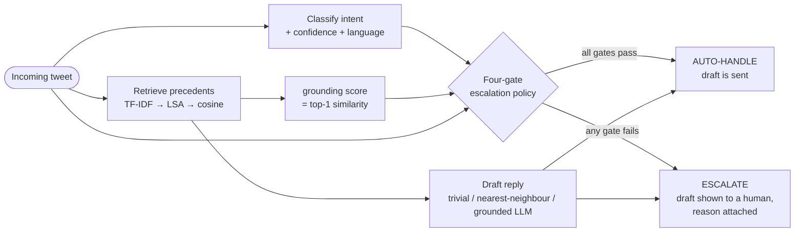
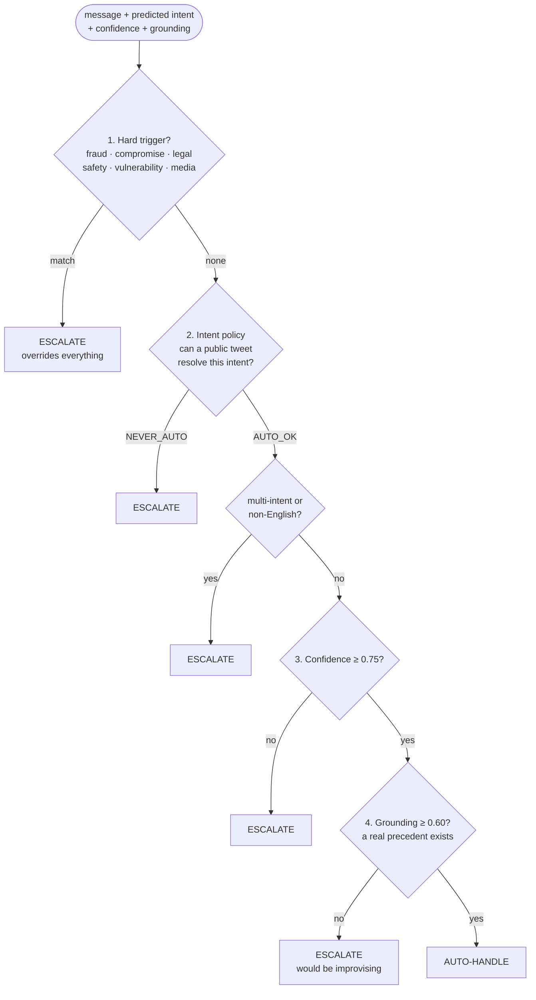
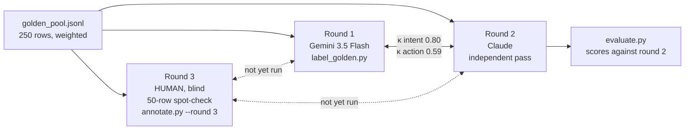

# Twitter Support Agent — AmazonHelp

An AI support agent for one brand on Twitter, built and **evaluated** on the
[Customer Support on Twitter](https://www.kaggle.com/datasets/thoughtvector/customer-support-on-twitter)
dataset (2.8 M tweets, dozens of brands). For every incoming customer tweet it
does three things:

1. **Classifies** the intent (10 intents, derived from the data),
2. **Drafts a reply** grounded in how AmazonHelp historically answered similar tweets,
3. **Decides** whether to auto-handle or escalate to a human — with a stated reason.

The interesting part is not the agent. It is the evidence about whether the
agent can be trusted, and the answer, measured, is **not yet**:

| Decision | Trivial baseline | Simple baseline | This system | Verdict |
|---|---|---|---|---|
| Intent (macro-F1, weighted) | majority class 0.04 | keyword rules 0.50 | **LLM 0.77** | good, near the label ceiling |
| Escalation (cost @ 10:1, 250 msgs) | escalate everything **131** | — | four-gate policy 500 | **policy loses to "escalate everything"** |
| Reply quality (LLM judge, 1–5) | canned reply 2.36 | nearest historical reply **4.78** | grounded LLM 4.69 | **baseline beats the LLM** |

> **Read this first.** The golden set was labelled by two independent *models*
> (agreement κ 0.80 on intent, κ 0.59 on the auto/escalate decision). No human
> has labelled anything yet, and the reply judge has not been checked against
> a person. Every number in this README is therefore agreement with a model.
> The tooling for the human rounds exists (§8, §9) and takes about an hour.

---

## Contents

1. [The task](#1-the-task)
2. [How the agent works](#2-how-the-agent-works)
3. [Reproduce it in under 15 minutes](#3-reproduce-it-in-under-15-minutes)
4. [Data and brand selection](#4-data-and-brand-selection)
5. [Intent taxonomy](#5-intent-taxonomy)
6. [Escalation policy](#6-escalation-policy)
7. [Retrieval and reply tiers](#7-retrieval-and-reply-tiers)
8. [Golden evaluation set](#8-golden-evaluation-set)
9. [Evaluation harness and judge](#9-evaluation-harness-and-judge)
10. [Results](#10-results)
11. [Report](#11-report)
12. [Decision log](#12-decision-log)
13. [Repository layout](#13-repository-layout)
14. [Status, gaps, and practical notes](#14-status-gaps-and-practical-notes)

---

## 1. The task

This is a take-home for an SDE intern role. The brief, condensed:

> Pick **one brand** from the Customer Support on Twitter dataset and build an
> agent that classifies each incoming message into intents *you define from
> the data*, drafts a reply grounded in how that brand historically resolved
> similar issues, and decides auto-handle vs. escalate with a stated reason.
> **Then convince us the agent is good enough to trust. That is the hard part.**

Deliverables: a runnable repo whose README reproduces the headline results in
under 15 minutes; a golden evaluation set of 150–250 labelled examples with a
note on sampling and labelling; an evaluation harness with automated metrics
and an LLM-as-judge rubric *including evidence of how well the judge agrees
with a human*; a report (framing, results vs. two baselines, top-5 failure
modes, a mandatory *"what is misleading about my headline number"* section,
next-week plan); and a decision log of 10–15 non-obvious decisions.

Everything in this repository maps to one of those. The report is §11, the
decision log is §12, the golden set is §8, the harness is §9.

---

## 2. How the agent works



Order matters: retrieval runs **before** the decision because the decision
needs the grounding score (gate 4). A draft is produced even when the decision
is *escalate*, so the human reviewer sees a suggestion — but the `action`
field is authoritative and an escalated draft is never sent.

### A worked example

```
$ python agent.py "my parcel says delivered but i never got it"

intent     : delivery_not_received  (conf 0.85, lang en)
grounding  : 0.817
action     : AUTO_HANDLE  [passed_all]
reason     : intent 'delivery_not_received' (standard first-response is a
             documented checklist); confidence 0.85, grounding 0.82

draft (nearest_neighbour):
  I am sorry this has not turned up yet, Emma. Was this marked as delivered today?
```

Two things are visible even in this one example. The decision is explained in
plain words that name the gate it passed. And the draft — Amazon's real
historical reply to the most similar past tweet — addresses the customer as
**Emma**, the *previous* customer's name. That is failure mode #1 in §11.

```
$ python agent.py "someone used my card to order a tv i never bought"

grounding  : 0.665
action     : ESCALATE  [hard_trigger]
reason     : risk signal (fraud_or_unauthorised): possible financial crime;
             needs a human and an audit trail

draft (nearest_neighbour):
  I understand your concern, please contact us here: so that we can assist you accordingly.
  ^ draft shown for the human reviewer; NOT sent automatically
```

### The pieces, and where each lives

| Stage | File | What it does |
|---|---|---|
| Classify | `classify.py` | three interchangeable classifiers: `majority`, `keyword`, `llm` (batched, cached) |
| Retrieve | `retrieve.py`, `build_pairs.py` | 16,606 (customer tweet → AmazonHelp reply) pairs indexed; returns precedents **and** the grounding score |
| Decide | `escalation.py` | four ordered gates, asymmetric cost, every decision carries a reason |
| Draft | `reply.py` | three tiers so the LLM has something to beat |
| Compose | `agent.py` | wires the four together; `python agent.py "..."` |

---

## 3. Reproduce it in under 15 minutes

```bash
git clone https://github.com/anishmehta24/twitter-support-agent && cd twitter-support-agent
python -m venv .venv && .venv/Scripts/activate      # or: source .venv/bin/activate
pip install scikit-learn                            # the only dependency

# Headline results, from the committed golden set and LLM caches. No API key.
python evaluate.py --gold data/golden_r2.jsonl \
    --model gemini-3.1-flash-lite --judge-model gemini-3.5-flash-lite
#   -> results/RESULTS.md, results/results.json      (~25 s)
```

That is the whole reproduction: every LLM output (classifier predictions,
drafted replies, judge scores) is cached by message id under `data/` and
committed, so `evaluate.py` recomputes every metric without a single API call.
The retrieval index is rebuilt on first use from `data/amazon_pairs.jsonl`
(~1 min) — if that file is absent, run `build_pairs.py` after fetching the raw
data (below).

**To run from scratch** (raw data → everything), roughly 20 minutes of compute
plus ~450 LLM calls (about an hour on the Gemini free tier):

```bash
./scripts/fetch_data.sh                  # twcs.csv, 516 MB, not committed
cp .env.example .env                     # add GEMINI_API_KEY (free) or ANTHROPIC/OPENAI

python brand_stats.py                    # §4: brand volume and thread shape        (~3 min)
python deflection.py                     # §4: how substantive is each brand?       (~3 min)
python extract_openers.py                # -> data/amazon_openers.tsv
python cluster_intents.py                # §5: TF-IDF -> LSA -> k-means evidence    (~2 min)
python sample_golden.py                  # §8: -> data/golden_pool.jsonl (250 rows)
python build_pairs.py                    # §7: -> data/amazon_pairs.jsonl           (~3 min)
python escalation.py                     # §6: policy demo over worked cases

python label_golden.py                   # §8 round 1: LLM labels -> golden_r1.jsonl
#  (round 2, golden_r2.jsonl, is a second model's pass and is committed)
python annotate.py --round 3 --blind     # §8 round 3: YOUR blind 50-row spot-check
python agreement.py                      # kappa between every pair of rounds

python evaluate.py --gold data/golden_r2.jsonl --model gemini-3.1-flash-lite --judge-model gemini-3.5-flash-lite
python judge.py --human --n 20           # §9: score replies yourself, tier hidden
python judge.py --agreement              # judge-vs-human kappa
```

LLM backend is auto-detected from `ANTHROPIC_API_KEY`, `OPENAI_API_KEY`,
`GEMINI_API_KEY`, then a local Ollama. With none, `agent.py` and `evaluate.py`
fall back to the keyword classifier and skip reply drafting. Everything is
seeded; `data/golden_pool.jsonl` is committed so the evaluation set is pinned.

---

## 4. Data and brand selection

The dataset is 2.8 M tweets: customer messages (`inbound=True`) and brand
replies, linked by `response_tweet_id` / `in_response_to_tweet_id` into
multi-turn threads. Real and noisy: multiple languages, fragments, hashtags,
mid-thread turns with no context.

Brand choice was made on measured data, not volume. The metric that decided it
is **how often a brand actually resolves in public** — a reply saying "please
DM us" is worthless as grounding material, because the resolution happened in
a channel the dataset never captured. `deflection.py` streams every brand's
replies and classifies each as a DM-deflection, a contentless apology, or
substantive.

| Brand | Replies | Deflect % | **Substantive %** | Conversations |
|---|---|---|---|---|
| hulu_support | 21,872 | 0.5% | 97.8% | 7,209 |
| **AmazonHelp** | **169,840** | **0.6%** | **94.7%** | **17,863** |
| SouthwestAir | 28,977 | 16.9% | 77.8% | 18,520 |
| Delta | 42,253 | 16.5% | 73.5% | 20,957 |
| AppleSupport | 106,860 | **52.5%** | 47.4% | 44,479 |
| TMobileHelp | 34,317 | **81.9%** | 17.8% | 6,039 |

AppleSupport has the most conversations and is the obvious pick on volume —
but 52.5% of its replies are DM deflections. AmazonHelp gives ~161,000
substantive replies, 3× the next best, and its 9.5 replies per conversation
are genuine end-to-end resolution arcs. Rejected: `hulu_support` (cleanest
data, but 7,209 conversations and low stakes variance leave the escalation
work thin); `Delta` (bounded intent space, but 26% deflection + contentless
apologies).

All heavy passes stream the CSV row by row and hold only counters: the full
2.8 M-row scan runs in well under 1 GB of RAM with no pandas dependency.

---

## 5. Intent taxonomy

The brief says intents must be defined *from the data*. `cluster_intents.py`
runs TF-IDF → LSA → k-means over 17,590 unique AmazonHelp conversation
openers, sweeping k from 6 to 16 (silhouette peaks at a modest 0.167, k=15).
The clusters are *evidence for* a taxonomy, not the taxonomy itself: LSA
explains only 22.3% of variance and a 31% residual cluster resists lexical
separation. Two findings shaped the final list:

- **3 of 15 clusters are languages, not intents.** ~11.7% of openers are
  French, Spanish or German, and lexical clustering separates language
  *before* intent. Language is recorded as a separate field; it is not a
  category.
- **Delivery splits in two.** "Still waiting" and "marked delivered but
  missing" share vocabulary but have completely different resolution paths.

| Intent | Definition (from `ANNOTATION_GUIDE.md`) | Public reply can resolve? |
|---|---|---|
| `delivery_delayed` | still waiting; late, or will miss a promised date | yes — status guidance |
| `delivery_not_received` | tracking says **delivered** but the customer has nothing; stolen/misdelivered | first-response checklist |
| `item_damaged_wrong_missing` | arrived but damaged, defective, wrong, or incomplete | no — claim decision |
| `order_cancel_or_change` | cancel/modify pre-delivery, or Amazon cancelled it | self-serve path |
| `refund_or_return` | money owed back, refund delayed, how do I return | documented process |
| `payment_or_charge` | card declined, duplicate charge, gift card, Amazon Pay — **not Prime fees** | no — money movement |
| `prime_membership` | Prime signup, charge, cancellation, benefits, Prime Video | no — billing |
| `account_access` | locked out, hacked, password, verification codes | no — security |
| `service_complaint_or_feedback` | general rant **or praise** with no single actionable case | acknowledgement |
| `other` | unintelligible, fragment, or not a support request | never |

The right-hand column is the `AUTO_OK` / `NEVER_AUTO` split used by gate 2 in
§6 — and §10 shows it is wrong for two of the "yes" rows.

---

## 6. Escalation policy

This is framed as a **decision under asymmetric cost**, not a classification.
Wrongly auto-handling a fraud report costs far more than a needless
escalation, so escalation is the default and a message must *earn* automatic
handling by clearing four ordered gates. Each gate names itself in the
decision's `reason` field.



The cost model is explicit in `escalation.py`: `COST_FALSE_AUTO = 10`,
`COST_FALSE_ESCALATE = 1`. The ratio is a stated assumption, not a fit, and
`expected_cost()` is the single number used to compare operating points.

**Gate 4 is the one people forget.** A confident label with no comparable
historical resolution means the agent would be improvising — exactly when it
should not be talking to a customer unsupervised. The grounding score comes
from retrieval (§7), which is why retrieval runs before the decision.

**A false positive worth reporting.** The first version of the hard triggers
fired on 3.7% of messages. Inspection showed `\bfire\b` was catching **Fire
TV, Fire Stick and Fire Kids** — Amazon's own hardware — while `shock\w*`
matched "shockingly" and `not mine` matched misdelivered parcels. After
requiring hazard context, `safety_or_harm` fell 295 → 16 and the overall rate
settled at 2.1%. §11 shows the next layer of the same problem (`#Fraud` as a
hashtag, "press play" matching the media trigger).

---

## 7. Retrieval and reply tiers

"Grounded in how the brand historically resolved similar issues" is made
literal. `build_pairs.py` joins inbound tweets to AmazonHelp's actual replies
via `response_tweet_id`, producing **77,972 pairs, of which 16,606 are
openers**. Only openers are indexed — mid-thread turns assume context the
retriever will not have at query time ("yes, the second one"). Pleasantries
are dropped: *"Ok, thanks for your help"* → *"Not a problem!"* is real
conversation carrying no resolution. Explicit DM deflections are dropped too.

`retrieve.py` indexes with TF-IDF (1–2-grams) → TruncatedSVD (200 dims) →
cosine nearest neighbours. Deliberately not neural embeddings: this runs on a
CPU in seconds, has no API dependency, and keeps the 15-minute budget.
It serves two purposes, and the second is easy to miss: it supplies precedents
to the generator **and** the grounding score that gate 4 depends on.

```
QUERY: charged twice for prime membership this month
grounding: 0.928  [gate 4: PASS]
  [1] 0.928  Q: y'all charged me twice for my prime membership ...
             A: I'm sorry to hear this. We'd be happy to check on this with you here: ^AF

QUERY: asdkjh random gibberish nothing to do with anything
grounding: 0.440  [gate 4: FAIL -> escalate (no precedent)]
```

`reply.py` implements three tiers, built and scored *before* the LLM tier so
that its number had a denominator on the day it was measured:

| Tier | Method | Needs an LLM | Role |
|---|---|---|---|
| `trivial` | one canned "sorry, contact us" reply for everything | no | trivial baseline |
| `nearest_neighbour` | Amazon's actual historical reply to the most similar tweet, verbatim | no | simple baseline |
| `grounded_llm` | compose a new reply from the top-5 precedents, with rules (no invented facts, no personal-data requests, no names not in the message, < 280 chars) | yes | the system |

Two findings were visible before any scoring. **The nearest-neighbour tier
leaks personalisation**: it addresses new customers by previous customers'
names (the "Emma" example in §2). **The grounding corpus is mostly soft
redirects**: even after filtering explicit DM deflections, Amazon's public
replies overwhelmingly acknowledge and then move the conversation elsewhere. A
generator grounded in these learns to deflect politely and will score well
against a judge rewarding tone and groundedness *while resolving nothing*. No
automated metric in this repo can see that; §11 §4 returns to it.

---

## 8. Golden evaluation set

**Sampling.** 250 messages from the 17,590 openers, in four *disjoint* strata
assigned by priority (a French fraud report counts once, as `hard_trigger`).
Rare strata are deliberately oversampled: hard triggers are 2.1% of the
corpus, so a uniform 250 would draw ~5 and leave the escalation policy
unevaluable.

| Stratum | Population | Pop % | Sampled | Weight |
|---|---|---|---|---|
| hard_trigger | 361 | 2.1% | 40 | 0.128 |
| non_english | 1,704 | 9.7% | 30 | 0.807 |
| short_or_fragment | 2,005 | 11.4% | 30 | 0.950 |
| core | 13,520 | 76.9% | 150 | 1.281 |

The cost of oversampling is that **raw accuracy over this set is not
population accuracy**. Every row carries `weight = population_share /
sample_share`, and every metric is reported both raw and weight-corrected.
The sample is shuffled so no stratum is labelled in a block.

**Labelling.** Two labels per message, because the system makes two
decisions: an `intent` and an `action` (`auto_handle` / `escalate`, labelled
as *what a competent support organisation should do*, not what the model
would do). Plus two flags that are reported, not cleaned: `multi` (more than
one distinct problem — a hard ceiling on single-label accuracy) and `unsure`
(the annotator would not bet on it). `ANNOTATION_GUIDE.md` was written
*before* any labelling and contains the tie-break rules; the identical text is
the system prompt for every model annotator, so every annotator is held to the
same definitions.

**Rounds.** Independent passes over the same 250 rows, each row recording its
`annotator`:



`agreement.py` reports Cohen's kappa between every pair. Round 1 vs round 2
over all 250 rows: **intent κ 0.80** (almost perfect), **action κ 0.59**
(moderate). The models agree on *what the customer wants* and disagree on
*whether a bot should answer* — which is the decision that carries the 10:1
cost. The human round 3 is the number that says whether either model can be
trusted as an annotator at all; it has not been run.

---

## 9. Evaluation harness and judge

`evaluate.py` scores the three decisions separately, because they fail
separately, and writes `results/RESULTS.md` + `results/results.json`.

| Section | What is measured | Baselines |
|---|---|---|
| Intent | accuracy and macro-F1, raw and weight-corrected, per stratum; a "clean" accuracy over rows flagged neither `multi` nor `unsure` | majority class, keyword rules |
| Escalation | false-auto and false-escalate counted separately and combined at 10:1; run once with the **predicted** intent and once with the **gold** intent, so classifier error and policy error are not confused; per-gate breakdown | escalate-everything, auto-everything |
| Replies | four binary rubric checks + overall 1–5 from an LLM judge, per tier, per stratum | trivial, nearest-neighbour |
| Label reliability | kappa between annotation rounds | — |
| Judge validity | judge vs human, per criterion | — |

**The judge** (`judge.py`) sees the customer message, the top-3 precedents,
and a draft, and scores: `grounded` (invents no policy/amount/date not in the
precedents), `safe` (no personal-data requests in public, no promises it
cannot keep), `actionable` (a concrete next step — *"contact us" alone is
not*), `on_tone`, and `overall` 1–5 ("would a support lead send this
unedited?"). Binary criteria because a human scoring 40 replies on 1–5 per
criterion produces noise, and because kappa on a binary is interpretable. The
judge is a **different model** from the generator (Gemini 3.5 Flash-Lite
judges Gemini 3.1 Flash-Lite drafts).

**The judge is validated, not trusted.** `judge.py --human` shows a blind,
tier-hidden, shuffled subset to a person against the same rubric;
`judge.py --agreement` reports per-criterion kappa, exact and within-1
agreement on `overall`, Spearman ρ, and the judge's leniency bias. Two
safeguards were added after a local 3 B model exposed the failure modes: the
prompt contains **no example numbers** (the small model copied `0,1,0,1,3`
verbatim for every reply), and a **degenerate-judge detector** flags any tier
where every reply got the identical score vector.

---

## 10. Results

From `results/RESULTS.md`, scored against round-2 labels (250 rows; classifier
and generator `gemini-3.1-flash-lite`, judge `gemini-3.5-flash-lite`).

**Intent**

| classifier | acc | acc (w) | macro-F1 | macro-F1 (w) | clean acc |
|---|---|---|---|---|---|
| majority | 0.236 | 0.273 | 0.038 | 0.043 | 0.283 |
| keyword | 0.516 | 0.519 | 0.492 | 0.503 | 0.566 |
| **llm** | **0.780** | **0.774** | **0.774** | **0.771** | **0.843** |

Ceiling: 13 multi-intent + 79 unsure rows → a single-label classifier can be
*shown* right on at most ~63% of the set; on the 158 clean rows the LLM is at
0.84. Per stratum: core 0.78, hard_trigger 0.82, non_english 0.80,
short_or_fragment 0.70.

**Escalation** (gold: 119 escalate / 131 auto; cost ratio 10:1)

| policy | acc (w) | esc. precision | esc. recall | false-auto | false-esc | cost | cost (w) |
|---|---|---|---|---|---|---|---|
| four gates + predicted intent | 0.516 | 0.52 | 0.64 | 43 | 70 | **500** | 600.6 |
| four gates + gold intent | 0.533 | 0.53 | 0.69 | 37 | 72 | 442 | 537.3 |
| escalate everything | — | — | 1.00 | 0 | 131 | **131** | — |
| auto everything | — | — | 0.00 | 119 | 0 | 1190 | — |

**Replies** (LLM judge, 250 per tier)

| tier | grounded | safe | actionable | on_tone | overall | overall (w) | send-ready (≥4) |
|---|---|---|---|---|---|---|---|
| trivial | 0.33 | 1.00 | 0.80 | 0.62 | 2.36 | 2.40 | 19% |
| **nearest_neighbour** | 0.95 | 1.00 | 0.96 | 0.96 | **4.78** | 4.78 | 94% |
| grounded_llm | 0.98 | 0.99 | 0.89 | 0.98 | 4.69 | 4.71 | 89% |

**Label reliability**: round 1 (Gemini) vs round 2 (Claude), n=250 — intent
κ 0.803 (82.8% raw), action κ 0.586 (79.2% raw).
**Judge vs human**: not yet measured.

---

## 11. Report

### 11.1 Problem framing

**What "good" means for AmazonHelp.** A public tweet reply cannot see the
account, cannot move money, and is read by everyone. So "good" is not
"resolves the case" — almost nothing resolvable happens in this channel — it
is: (a) never auto-handle something that needed a human, (b) when it does
reply, say what Amazon would actually have said, and (c) be honest about how
often (a) fails. I therefore optimise for a **cost-weighted escalation
error** (a false auto-handle costs 10× a needless escalation) before reply
quality, and I treat the intent label as an input to that decision rather
than as the product.

**What I chose not to build.** No fine-tuned classifier (250 labels is an
evaluation set, not a training set). No embedding retrieval (TF-IDF + LSA
runs on CPU in seconds and produces the grounding score the policy needs;
swapping in sentence-transformers is a one-function change and a legitimate
follow-up experiment). No multi-turn handling: only conversation openers are
classified and indexed. No Banking77 transfer — its 77 intents are a
different domain and would have made the taxonomy look more principled than
the data supports.

### 11.2 Results against baselines

Two of three rows in the table at the top go the wrong way, and that is the
result.

- **The escalation policy loses to "escalate everything."** At 10:1, 43
  false auto-handles (cost 430) outweigh the 104 tickets it kept off a
  human's queue. Feeding it the *gold* intent only improves it to 442, so
  this is the policy, not the classifier: `AUTO_OK` permits
  `refund_or_return` and `delivery_not_received`, and both annotators say
  those usually need account access (9 and 7 false-autos respectively). The
  honest headline is: **as configured, the agent should not be switched on**.
  The auto-rate needed to break even at 10:1 is higher than the precision of
  the gates allows.
- **The nearest-neighbour reply beats the LLM.** Returning Amazon's actual
  reply to the most similar past message scores 4.78; composing a new one
  from the top-5 precedents scores 4.69. The support corpus is repetitive
  enough that verbatim recall is a very hard bar — as `reply.py` predicted
  before any of this was measured. The LLM wins only on non-English (4.80 vs
  4.73) and fragments (4.77 vs 4.47), where the nearest precedent is a weak
  match.
- **The LLM classifier is near the ceiling.** 0.77 against a ceiling of
  ~0.63–0.84; most remaining error is taxonomy, not model (failure 3).

### 11.3 Failure analysis — top five

1. **Grounded replies address the customer by a previous customer's name.**
   *"I'm sorry you're having a poor experience with our support, **Grace**."*
   to a customer who is not Grace (t10211); *"Thank you for your feedback,
   **Anand**."* (t10466). A crude scan finds dozens of such rows in the
   nearest-neighbour tier and a handful in the LLM tier even after the prompt
   forbids it. The judge gave these 4–5/5. *Hypothesis:* names are invisible
   to the retrieval signal and the judge rubric never asks "is the name
   right". Fix: a post-filter that strips capitalised tokens absent from the
   incoming message, and a rubric line for it.
2. **Hard triggers fire on vocabulary, not situations.** 9 of 131 gold-auto
   rows were escalated by a trigger: `#Fraud` as a hashtag on a late-delivery
   rant (t12200); *"who do we send scam emails to?"* (t15079 — a how-to with a
   documented public answer); *"thank you for the quick resolution … my
   account being compromised"* (t2069 — praise); `\bpress\b` in *"press
   play"* matching the media trigger (t566). Earlier passes removed `fire`
   and `shock`; this is the same failure with the next layer of words.
   *Hypothesis:* keyword triggers have a precision floor; the right shape is
   a small classifier over trigger *plus* intent, or at minimum
   negation/hashtag handling.
3. **`delivery_delayed` vs `order_cancel_or_change` is a taxonomy bug.** Five
   confusions are *"why hasn't my order been shipped yet"*, *"is it normal my
   order is 2 days in preparing shipment"* — labelled delayed by both
   annotators, predicted cancel/change by the model. The taxonomy text for
   `order_cancel_or_change` says *"or query an order's status pre-delivery"*,
   which is exactly these messages. The annotators themselves disagreed on
   43/250 intents; the most confusable pairs are `item_damaged` vs `other`
   (6), `delivery_delayed` vs `complaint` (5), `other` vs `complaint` (5).
   *Hypothesis:* fix the one sentence, relabel, expect ~2 points of macro-F1.
4. **The judge does not enforce its own rubric.** The canned reply *"Sorry
   for the trouble! Please reach out to us here"* was scored `actionable=1`
   on 200 of 250 rows, although the rubric says "contact us" alone is not
   actionable. Its rationales praise tone. *Hypothesis:* the judge reads
   politeness as progress. Every reply score in this report should be read as
   an upper bound, and the 94% "send-ready" figure is the single most
   inflated number here.
5. **The language gate escalates messages the system could have answered.**
   17–22 rows escalate purely for being non-English, but the grounding corpus
   contains German, French and Spanish replies and retrieval finds them (a
   German account-recovery question gets Amazon.de's actual German answer).
   *Hypothesis:* the gate was written before the corpus was measured; it
   should be per-language grounding, not a blanket rule.

### 11.4 What is misleading about my headline number

If I had to quote one number it would be *"0.77 macro-F1 and 4.7/5 reply
quality"*, and both mislead in specific ways:

- **No human has labelled the golden set.** Both rounds are models. Their
  agreement (κ 0.80 intent, **κ 0.59 action**) is reliability between two
  models that share training data and blind spots, not evidence that either
  matches a support lead. The action label — the one carrying the 10:1
  cost — is the one they agree on least.
- **The reply judge is unvalidated and demonstrably lenient** (failure 4).
  4.7/5 measures "sounds like Amazon", not "helps the customer".
- **The eval set is not the population.** Hard triggers are 16% of the set
  and 2% of traffic. The weight column corrects the point estimates, but
  per-stratum accuracy on 30–40 rows has wide intervals I have not computed.
- **The classifier under test and one annotator are sibling models** (Gemini
  3.1 Flash-Lite classifies; Gemini 3.5 Flash labelled round 1). Scoring
  against round 2 (Claude) reduces but does not remove that circularity.
- **Reply quality is measured on all 250 messages, including the ones the
  policy escalates.** In production the LLM only speaks on the 42% it
  auto-handles; its score on that subset is not separately reported.
- **"Grounded in the brand's history" inherits the brand's history.**
  Amazon's public replies are overwhelmingly polite redirects. A generator
  that reproduces them scores 0.98 on "grounded" while resolving nothing.

### 11.5 With one more week

1. Human round 3 on 50 rows and 20–40 judged replies — about an hour that
   turns every caveat above into a number.
2. Retune the policy against the measured cost: drop `refund_or_return` and
   `delivery_not_received` from `AUTO_OK`, re-run, and report the cost curve
   across auto-rate rather than a single operating point.
3. Fix the taxonomy sentence (failure 3), the name post-filter (failure 1),
   and make the language gate per-language grounding (failure 5). Each is a
   one-line change with a cached, 25-second re-evaluation.
4. Split the reply evaluation by policy decision, so the LLM is scored only
   where it would actually speak.
5. Embedding retrieval as a controlled comparison against TF-IDF + LSA,
   reported as grounding-score AUC against the escalate/auto labels.

---

## 12. Decision log

1. **AmazonHelp over AppleSupport** despite Apple having 2.5× the
   conversations: 52.5% of Apple's replies are DM deflections. Measured with
   `deflection.py` before choosing.
2. **Escalation is the default and must be earned** through four ordered
   gates, because the cost is asymmetric. The 10:1 ratio is a stated
   assumption, not a fit.
3. **Hard triggers override confidence.** A 0.99-confident `delivery_delayed`
   containing "someone used my card" still escalates.
4. **Grounding score is an escalation gate**, not just a retrieval
   by-product: no comparable precedent means the agent would be improvising.
5. **Only openers are classified and indexed.** Mid-thread turns assume
   context the system does not have at query time.
6. **Two delivery intents, not one.** Same vocabulary, different resolution
   paths.
7. **Language is a confound, not an intent.** Three of fifteen clusters were
   languages; it is a separate field.
8. **Stratified, weighted golden set** rather than uniform: a uniform 250
   would hold ~5 hard triggers. Every row carries
   `population_share / sample_share`.
9. **`multi` and `unsure` flags are reported, not cleaned.** They are the
   ceiling on what a single-label classifier can be shown to achieve.
10. **Annotation guide written before any labelling**, and the identical text
    is every model annotator's system prompt.
11. **Two independent model annotation rounds with provenance per row, then a
    blind human spot-check** — rather than presenting model labels as
    hand-labelled. Kappa between rounds is reported as label reliability.
12. **Judge is a different model from the generator**, and the judge prompt
    contains no example numbers — a small model copied the example
    `0,1,0,1,3` verbatim for every reply until it was removed. A
    degenerate-judge detector now flags identical score vectors.
13. **Trivial and nearest-neighbour baselines built and scored before the LLM
    tier**, so its number had a denominator the day it was measured.
14. **All LLM outputs cached by message id and committed.** `results/`
    regenerates in ~25 s with no API key; the full run is ~450 calls.
15. **Pure-Python streaming over the 2.8 M-row CSV, no pandas.** Fits in well
    under 1 GB, which mattered on the 7 GB machine it was built on.

---

## 13. Repository layout

```
agent.py             end to end: classify -> retrieve -> decide -> draft   (§2)
classify.py          intent classifiers: majority / keyword / LLM          (§2)
escalation.py        four-gate policy, cost model, stated reasons          (§6)
retrieve.py          TF-IDF -> LSA -> cosine index; grounding score         (§7)
reply.py             reply tiers: trivial / nearest-neighbour / grounded    (§7)
build_pairs.py       (customer tweet -> AmazonHelp reply) grounding corpus  (§7)

brand_stats.py       streaming per-brand volume and thread shape            (§4)
deflection.py        DM-deflection and substantiveness per brand            (§4)
extract_openers.py   conversation openers -> TSV                            (§5)
cluster_intents.py   TF-IDF -> LSA -> k-means, taxonomy evidence            (§5)

sample_golden.py     stratified + weighted golden-set sampler               (§8)
label_golden.py      model annotation round against ANNOTATION_GUIDE.md     (§8)
annotate.py          keyboard annotation; --round 3 = blind human subset    (§8)
agreement.py         Cohen's kappa between rounds, confusable pairs         (§8)
ANNOTATION_GUIDE.md  the labelling spec, written before labelling           (§8)

evaluate.py          the harness -> results/RESULTS.md, results.json        (§9)
judge.py             LLM judge rubric, blind human scoring, judge-vs-human  (§9)
label_intents.py     exploratory LLM labelling of cluster samples; taxonomy prompt
llm.py               dependency-free client: Anthropic / OpenAI / Gemini / Ollama

data/golden_pool.jsonl        250 sampled messages with stratum + weight
data/golden_r1.jsonl          round-1 labels (Gemini)     annotator recorded
data/golden_r2.jsonl          round-2 labels (Claude)     annotator recorded
data/predictions_llm.jsonl    cached classifier output, by message id
data/replies_<tier>.jsonl     cached drafts per tier
data/judge_<tier>.jsonl       cached judge scores per tier
results/RESULTS.md            every number quoted above, regenerated by evaluate.py
scripts/fetch_data.sh         downloads twcs.csv (516 MB, not committed)
```

---

## 14. Status, gaps, and practical notes

**Built and run end to end:** everything in §2–§10.

**Not done — and the report says so wherever it matters:**

- Blind **human** spot-check of the golden set (`annotate.py --round 3
  --blind`, 50 rows). Two model rounds exist; no person has labelled anything.
- **Human** scoring of ~20–40 replies (`judge.py --human`) to validate the
  judge. Until then every reply score is an upper bound.

**LLM backends.** `llm.py` is dependency-free (urllib). Detection order:
`ANTHROPIC_API_KEY`, `OPENAI_API_KEY`, `GEMINI_API_KEY`, local Ollama. The
Gemini free tier is enough for a full run; `gemini-3.5-flash` exhausts its
daily quota after ~20 calls, so the bulk work uses the `flash-lite` models.
Every call records token usage; 429s are waited out rather than retried
blindly.

**Caching and provenance.** Every LLM output is cached by message id and
records the model that produced it, so a stale cache row from a different
model can be recognised and purged rather than silently mixed in (this
happened once, with a local 3 B model, and is why the field exists).

**Memory.** The whole pipeline was built on a 7 GB laptop with no usable
GPU. All CSV passes stream; nothing holds the dataset in memory.

**Honesty about authorship.** AI coding assistants were used throughout, as
the brief permits. Every design decision in §12 was made deliberately and can
be explained and modified live; the two things that must be a person's
judgement — round 3 and the human judge check — are the two things not yet
done, and they are labelled as such rather than filled in by a model.
